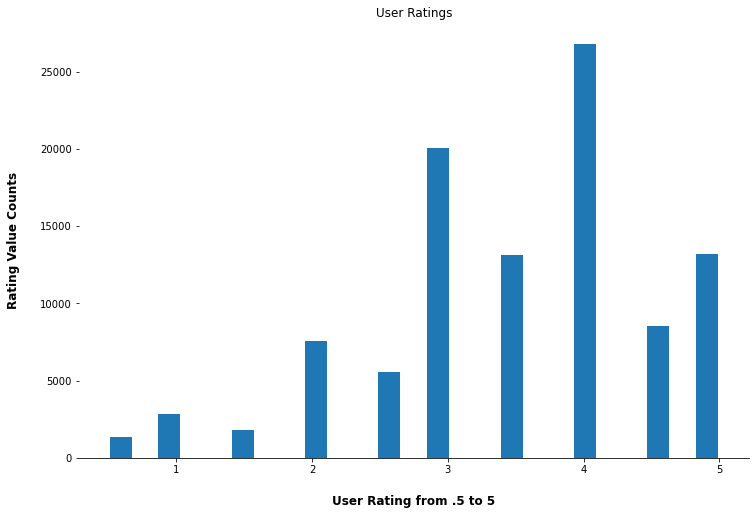

# MovieLens Analysis

**Author**: Bridget Coleman


## Overview

User ratings and other movie information was analyzed to produce recommendations for new and existing users.

## Business Problem

With so many options for users, providing the best possible recommendations for an individual may keep them with a particular service.  

## Data



The data is from movielens.org.  The smaller dataset was used.  The dataset gave information on 610 users and 9,742 movies.  The users rated at least 20 movies.

## Methods

This project tested several models.  The final model was the one that provided the greatest accruacy on predicting a user's rating of a movie.   


## Results

The SVD model was the best option.  The predicted rating for a user may be off on average of just under one star on a a scale of .5-5 stars.  

This result was the best out of the three models that were tested.  


## Conclusions and next steps

The smaller dataset was used for this project.  The larger dataset has over 58,000 movies and over 280,000 users.  Will the SVD model provide the best model and results?

New users should continue to be added and the recommendations should be checked.

Consider adding new items to the dataset such as television shows.  This will give the potential customers more options.  

## For More Information

Please review the full analysis in [our Jupyter Notebook](https://github.com/bkcoleman1024/Microsoft_Analysis/blob/main/Microsoft_Analysis.ipynb) or the [presentation](https://github.com/bkcoleman1024/Microsoft_Analysis/blob/main/Microsoft%20presentation.pdf).

For any additional questions, please contact Bridget Coleman, bkcoleman1024@gmail.com

## Repository Structure


```
├── README.md   
├── Movielens_presentation.pdf
├── images            
└── Movielens_Analysis.ipynb         
```
